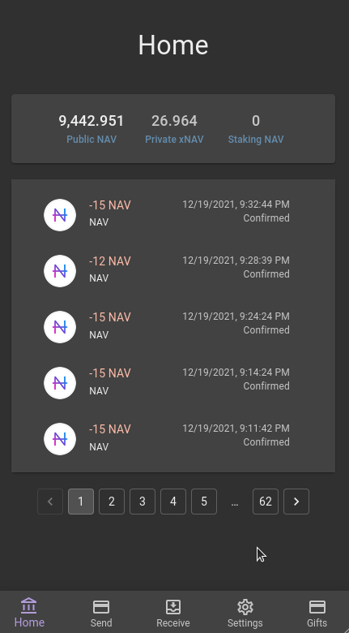

# navcoin-js hackathon

This is my resulting project for the navcoin-js hackathon. 

General hackathon guidelines were to build a privacy-focused app that makes creative use of the xNAV currency and the `navcoin-js` library.

## idea

My idea revolved around generating gift codes which are supposed to act as a temporary storage for the NAV currency.

Consider Alice generating a gift code for Bob. Some possible use cases:
- Bob does not have a wallet yet, as having a gift code would motivate Bob to create one
- Bob prefers not to share his receiving adress
- Bob does not have his receiving address by hand
- Alterntively, Alice would like to temporarily store some of her funds outside of her main wallet

## features 

### generating gift code

Gift codes can be generated under Gifts tab. After a successful transaction, a dialog will appear with both a QR and a text version of the gift code which can be copied to clipboard.

### redeeming a gift code

Gift codes can be redeemed on the Gifts tab. After a gift code has been redeemed successfully, the redeeming transaction will appear on the list along with the regular transactions. In order to differentiate the redeemed gifts, a small gift icon is displayed next to it.

### redeeming a gift code without a wallet

Aimed at users without a wallet, there is an option to redeem a gift code along with new wallet creation.

## notes

As this was one of my first experiences interacting with blockchain and my first time using React, the project is not as polished as I would have liked it to be! Nevertheless I'm happy with the way it turned out and how much I learned in the process.

## instructions to run locally

1. Clone the repository
2. Install the npm packages using `npm install`
3. Start the application using `yarn start`