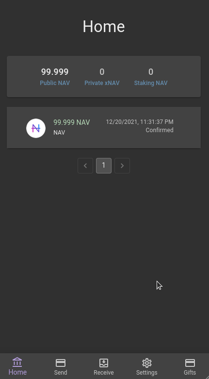
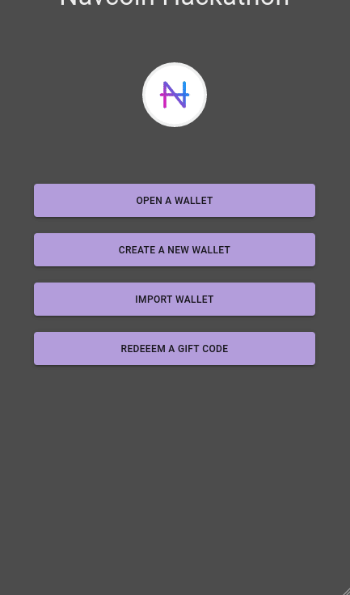

# navcoin-js hackathon

This is my project for the navcoin-js hackathon. 

General hackathon guidelines were to build a privacy-focused app that makes creative use of the xNAV currency.

## idea

My idea revolved around generating gift codes which are supposed to act as a temporary storage for the NAV currency.

Consider Alice generating a gift code for Bob. Some possible use cases:
- Bob does not have a wallet yet, as having a gift code would motivate Bob to create one
- Bob prefers not to share his receiving adress
- Bob does not have his receiving address by hand
- Alice would like to temporarily store some of her funds outside of her main wallet  

## features 

### generating gift code

### redeeming a gift code

Gift codes can be redeemed on the Gifts tab by pasting the gift code.

### redeeming a gift code without a wallet

Aimed at users without a wallet, there is an option to redeem a gift code along with new wallet creation.

## instructions to run locally

Clone the repo, install the npm packages using `npm install` and start the application using `yarn start`.